# Adaptive Weather Dashboard

A production-grade multi-platform weather application built with Flutter, demonstrating clean architecture, responsive design, and scalable project infrastructure.

**Live Demo:** [https://adaptive-weather-dashboard.web.app](https://adaptive-weather-dashboard.web.app)

## Screenshots

<table>
  <tr>
    <td align="center">
      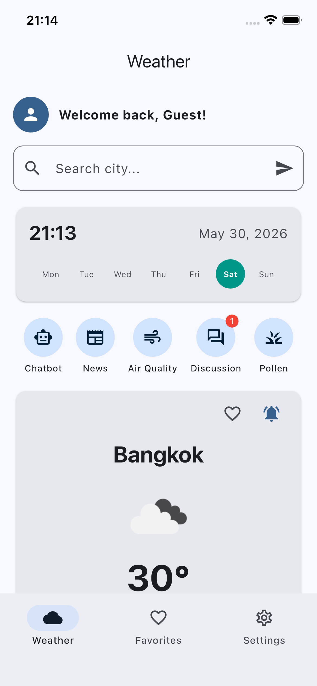<br/>
      <sub><b>Weather</b><br/>Search, current conditions, shortcut bar with unread badge</sub>
    </td>
    <td align="center">
      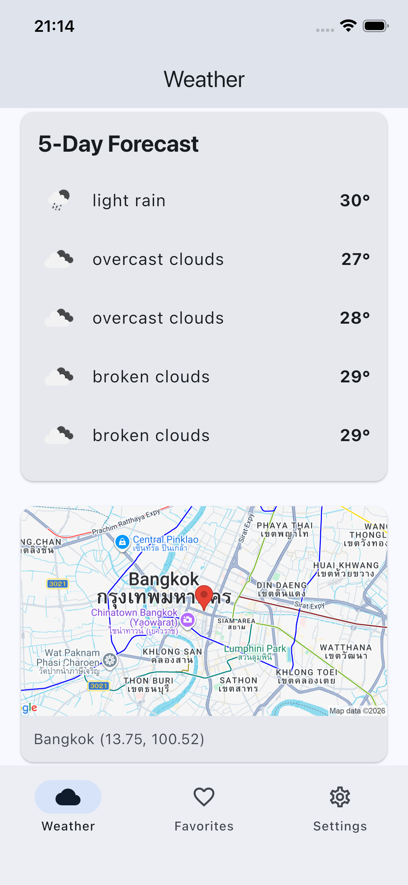<br/>
      <sub><b>Forecast &amp; Map</b><br/>5-day forecast and static map of the searched city</sub>
    </td>
    <td align="center">
      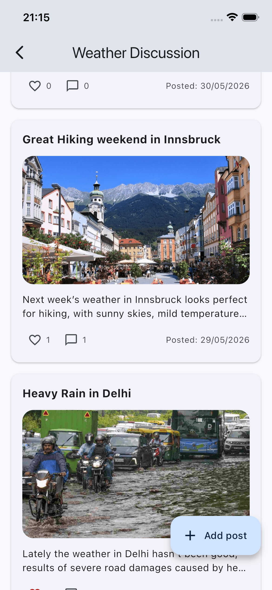<br/>
      <sub><b>Discussion Feed</b><br/>Firestore-backed community posts with likes &amp; comments</sub>
    </td>
    <td align="center">
      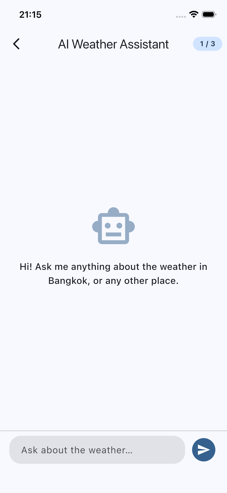<br/>
      <sub><b>AI Chatbot</b><br/>Gemini-powered weather assistant with daily quota</sub>
    </td>
  </tr>
  <tr>
    <td align="center">
      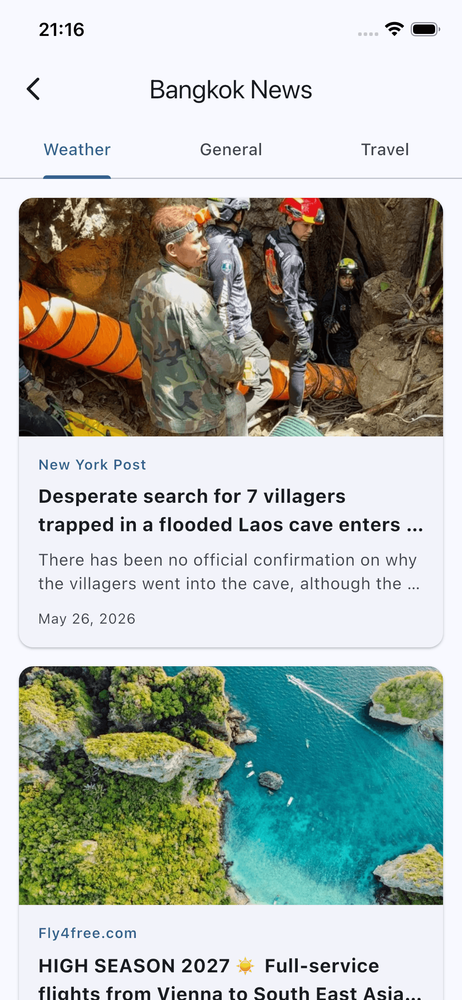<br/>
      <sub><b>News</b><br/>Three category tabs, in-app browser via SFSafariViewController</sub>
    </td>
    <td align="center">
      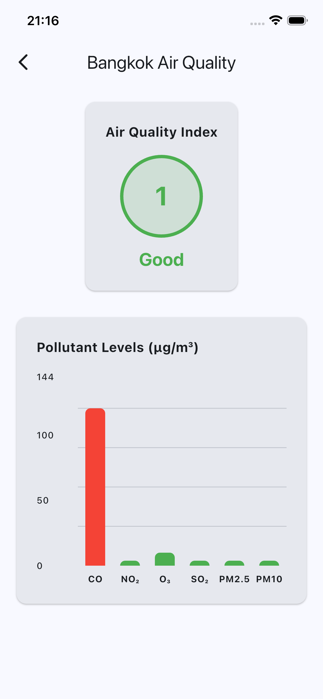<br/>
      <sub><b>Air Quality</b><br/>AQI index with pollutant breakdown via fl_chart</sub>
    </td>
    <td align="center">
      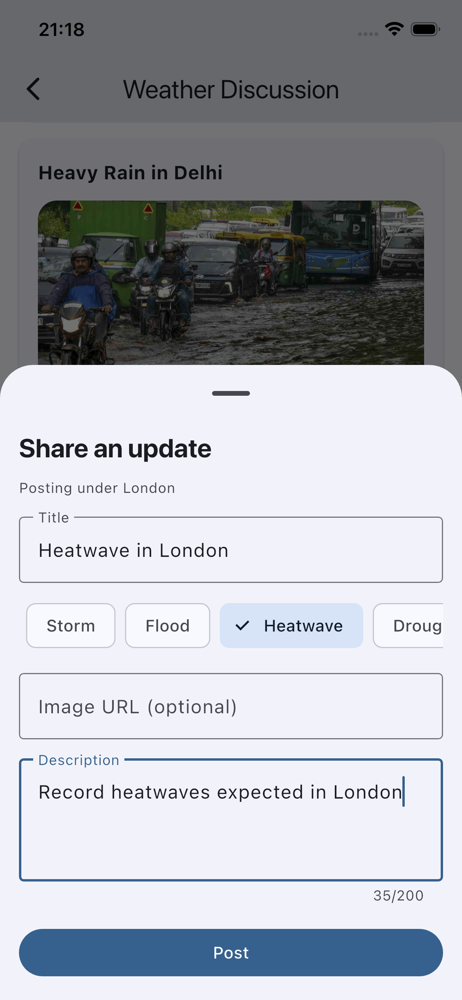<br/>
      <sub><b>Create Post</b><br/>Event-type chips auto-fill the title with the searched city</sub>
    </td>
    <td align="center">
      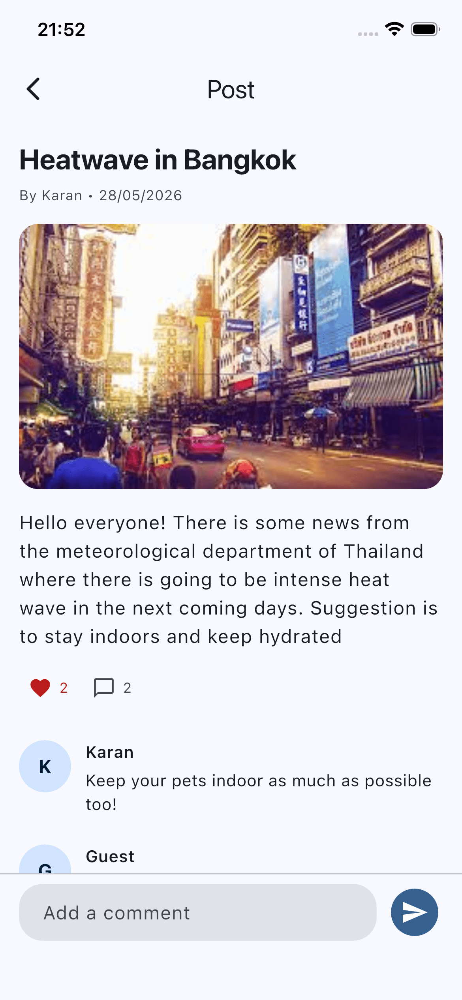<br/>
      <sub><b>Post Detail</b><br/>Threaded comments with 50-char limit, swipe-back to feed</sub>
    </td>
  </tr>
  <tr>
    <td align="center" colspan="2">
      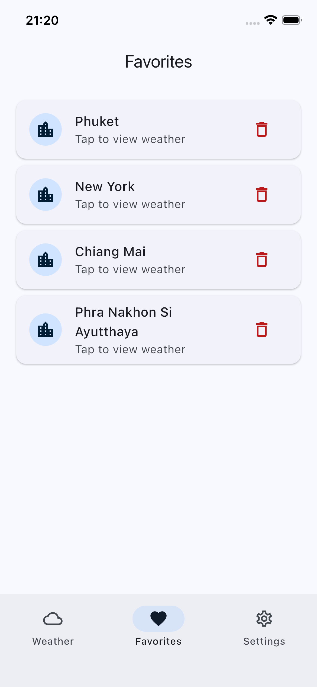<br/>
      <sub><b>Favorites</b><br/>Local Hive storage, tap to load weather instantly</sub>
    </td>
    <td align="center" colspan="2">
      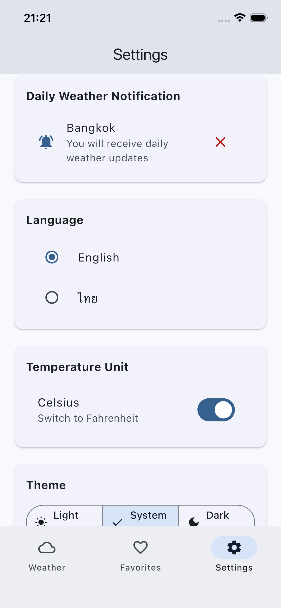<br/>
      <sub><b>Settings</b><br/>Theme mode, language (EN / TH), and temperature units</sub>
    </td>
  </tr>
</table>

### Responsive — same code, all five platforms

<table>
  <tr>
    <td align="center">
      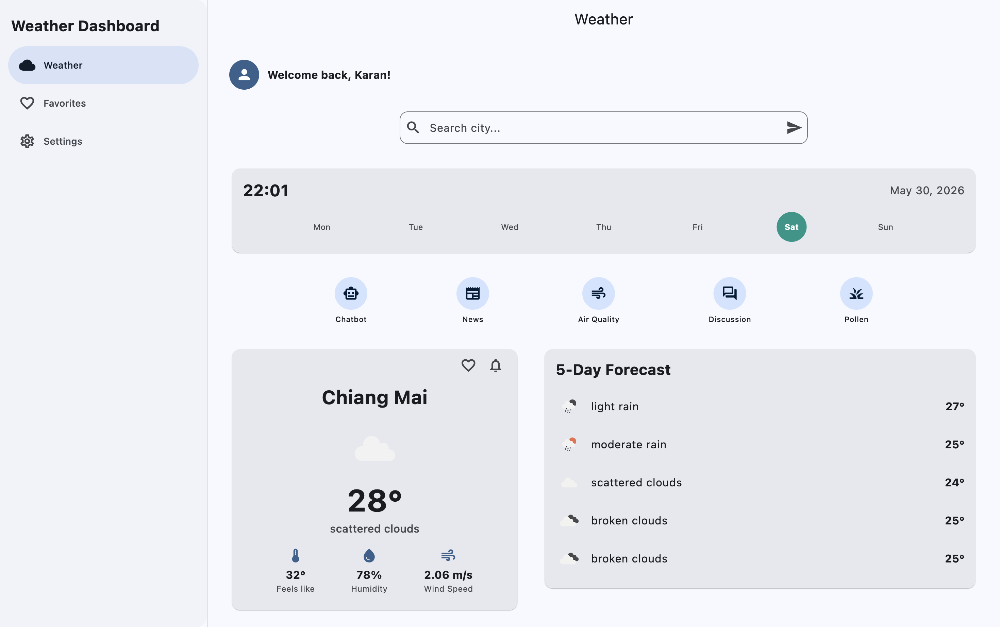<br/>
      <sub><b>Desktop</b> — navigation drawer, wider weather layout, responsive shortcut bar with evenly-spread items</sub>
    </td>
  </tr>
</table>

### Branded splash

<table>
  <tr>
    <td align="center">
      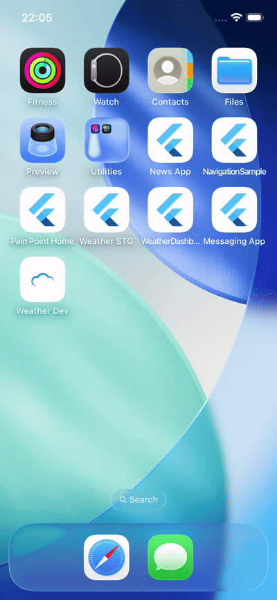<br/>
      <sub><b>Launch animation</b> — native cold-start splash hands off seamlessly to a Flutter-side splash with fade-in + elastic-scale animation and a launch sound</sub>
    </td>
  </tr>
</table>

---

## Overview

Adaptive Weather Dashboard is a portfolio project showcasing production-level Flutter engineering practices. The app features user authentication, weather search with real-time city data, 5-day forecasts, favorite cities, air quality visualization, push notifications, an AI weather chatbot, a community discussion feed, an in-app news reader, and multi-language support — all running across five platforms from a single codebase.

## Platforms

- iOS
- Android
- Web
- macOS
- Windows

All platforms share the same codebase with adaptive UI that automatically adjusts navigation patterns and layouts based on screen size.

## Features

- **Authentication** — Email/password sign up and sign in with Firebase Auth, user data stored in Firestore
- **Weather Search** — Search any city for current weather conditions with temperature, humidity, wind speed, and weather icon
- **5-Day Forecast** — Grouped daily forecast from OpenWeatherMap's 3-hour interval data
- **City Time Display** — Shows the searched city's local time, date, and highlighted day of the week using timezone offset
- **Favorite Cities** — Save and remove favorite cities with local Hive storage, tap to load weather instantly
- **Air Quality** — Visualize air quality index and pollutant levels (CO, NO₂, O₃, SO₂, PM2.5, PM10) with interactive bar charts
- **Push Notifications** — Daily weather notifications for a selected city via Firebase Cloud Messaging with a scheduled Cloud Function
- **Static Map** — Google Static Maps showing the searched city's location with a pin marker
- **AI Weather Chatbot** — Conversational assistant powered by Google Gemini 2.5 Flash with last-searched-city context awareness, gated by a 3-message daily quota persisted in SharedPreferences (foundation for a future paid tier)
- **Weather News Feed** — Per-city news from NewsAPI with three tabs (Weather / General / Travel), pull-to-refresh, and in-app browser via `LaunchMode.inAppBrowserView` (SFSafariViewController / Chrome Custom Tabs)
- **Weather Discussion** — Firestore-backed community feed where users post about weather events from six structured chips (Storm / Flood / Heatwave / Drought / Wildfire / Tornado), add comments (50-char limit), like posts (per-user with `arrayUnion`/`arrayRemove`), and delete their own content with cascade
- **Unread Post Badge** — Red badge on the Discussion shortcut showing posts created since the user's last visit, computed via a single Firestore `.count()` aggregation per city search, capped visually at "9+"
- **Branded Splash Screen** — Native cold-start splash (iOS launch storyboard + Android adaptive splash) followed by a Flutter splash with fade-in + elastic-scale animation and a launch sound via `audioplayers`
- **Quick Access Shortcuts** — Contextual shortcuts for Chatbot, News, Air Quality, Discussion, and Pollen — horizontal-scrollable on mobile, evenly spread on tablet/desktop, gated by `isSearched`
- **Multi-Language** — English and Thai with compile-time safe localization using ARB files
- **Theme Switching** — Light, dark, and system theme modes persisted in SharedPreferences
- **Temperature Units** — Toggle between Celsius and Fahrenheit
- **App Version Display** — Dynamic version display in settings using package_info_plus
- **Crash Reporting** — Production observability via Firebase Crashlytics. All uncaught Flutter framework errors and uncaught async errors are recorded as fatal with full stack traces, grouped issues, and crash-free user metrics in the Firebase Console

## Tech Stack

| Concern | Package | Rationale |
|---|---|---|
| State Management | `flutter_bloc` | Event-driven, testable, scales well for complex apps |
| Dependency Injection | `injectable` + `get_it` | Auto-generated DI eliminates manual registration at scale |
| Networking | `dio` + `retrofit` | Retrofit generates clean API clients from annotations |
| Functional Error Handling | `fpdart` | Explicit `Either<Failure, Success>` eliminates try-catch sprawl |
| Navigation | `go_router` | URL-based routing works natively for web, official Flutter team package |
| Authentication | `firebase_auth` | Industry-standard auth with email/password support |
| Cloud Database | `cloud_firestore` | Real-time cloud storage for user data and notification preferences |
| Push Notifications | `firebase_messaging` + `flutter_local_notifications` | FCM for background/terminated delivery, local notifications for foreground display |
| Crash Reporting | `firebase_crashlytics` | Captures uncaught Flutter framework and async errors with full stack traces, grouped by issue in the Firebase Console |
| Local Storage | `hive_ce` | Fast, type-safe key-value storage that works across all platforms |
| Preferences | `shared_preferences` | Standard solution for simple user preferences |
| Charts | `fl_chart` | Lightweight, customizable bar charts for air quality visualization |
| Maps | Google Static Maps API | Simple embeddable map images without SDK overhead |
| AI Chat | Google Gemini 2.5 Flash REST API | Cheap, fast, generous free tier on AI Studio — used via a dedicated named Dio binding so credentials never cross-pollinate with other services |
| News | NewsAPI.org | Simple REST, free tier covers portfolio scope — three category-shaped queries per page (Weather / General / Travel) against `/everything` |
| In-App Browser | `url_launcher` (`LaunchMode.inAppBrowserView`) | Cross-platform — SFSafariViewController on iOS, Chrome Custom Tabs on Android, new tab on web/desktop, no embedded WebView dependency |
| Splash Audio | `audioplayers` | One-shot launch sound, gracefully no-ops on web autoplay blocks or missing assets |
| Native Splash | `flutter_native_splash` | Generates iOS launch storyboard + Android adaptive splash + matching web splash from a single config block |
| App Icons | `flutter_launcher_icons` | Generates Android, iOS, web, macOS, and Windows launcher icons from a single source PNG |
| Localization | `flutter_localizations` + `intl` + ARB | Compile-time safe translations with automatic date and number formatting |
| App Info | `package_info_plus` | Dynamic version display from pubspec.yaml |

## Architecture

The project follows **clean architecture** with three distinct layers per feature, with a lighter approach for simpler features:

```
lib/
├── core/                           ← Shared infrastructure
│   ├── config/                     ← Environment configuration (AppConfig)
│   ├── constants/                  ← API endpoints
│   ├── error/                      ← Failure and exception classes
│   ├── l10n/                       ← Localization files (.arb) and extension
│   ├── layout/                     ← AdaptiveScaffold
│   ├── network/                    ← Network connectivity checker
│   ├── responsive/                 ← Breakpoints, ResponsiveBuilder, ResponsiveValue
│   ├── router/                     ← go_router with auth redirect guard
│   └── theme/                      ← Light and dark themes
├── features/
│   ├── auth/                       ← Full clean architecture (data/domain/presentation)
│   │   ├── data/                   ← Firebase Auth data source, user model
│   │   ├── domain/                 ← AppUser entity, AuthRepository, use cases
│   │   └── presentation/           ← AuthBloc, login/register pages
│   ├── weather/                    ← Full clean architecture
│   │   ├── data/                   ← Retrofit API client, weather/forecast models
│   │   ├── domain/                 ← Weather/Forecast entities, repository, use cases
│   │   └── presentation/           ← WeatherBloc, responsive layouts, shared widgets
│   ├── favorites/                  ← Full clean architecture
│   │   ├── data/                   ← Hive local data source
│   │   ├── domain/                 ← FavoriteCity entity, repository, use cases
│   │   └── presentation/           ← FavoritesBloc, responsive layouts
│   ├── notifications/              ← Full clean architecture
│   │   ├── data/                   ← Firestore data source, FCM service
│   │   ├── domain/                 ← NotificationCity entity, repository, use cases
│   │   └── presentation/           ← NotificationBloc, notification city card
│   ├── settings/                   ← Presentation only
│   │   └── presentation/           ← SettingsBloc, theme/language/unit selectors
│   ├── air_quality/                ← Lightweight architecture (no repository/use cases)
│   │   ├── data/                   ← AirQualityService (fetch + parse in one class)
│   │   ├── domain/
│   │   │   └── entities/           ← AirQuality entity
│   │   └── presentation/
│   │       └── pages/              ← FutureBuilder-based page with fl_chart
│   ├── chatbot/                    ← Full clean architecture
│   │   ├── data/                   ← Retrofit client for Gemini, SharedPreferences quota source
│   │   ├── domain/                 ← ChatMessage/ChatQuota entities, repository, use cases
│   │   └── presentation/           ← ChatbotBloc, responsive page, message bubbles, typing indicator
│   ├── news/                       ← Lightweight architecture
│   │   ├── data/                   ← NewsService (raw Dio + inline parsing of NewsAPI articles)
│   │   ├── domain/
│   │   │   └── entities/           ← NewsArticle, NewsCategory
│   │   └── presentation/           ← StatefulWidget with TabController, per-category FutureBuilders
│   ├── discussion/                 ← Full clean architecture, ShellRoute-scoped FeedBloc
│   │   ├── data/                   ← Firestore data source with batched cascade deletes
│   │   ├── domain/                 ← Post/Comment entities, repository, 8 use cases
│   │   └── presentation/           ← FeedBloc + DetailBloc + CreatePostBloc + DiscussionUnreadBloc (global)
│   └── splash/                     ← Lightweight architecture
│       └── presentation/
│           └── pages/              ← Animated branded splash with audio playback
├── di/                             ← Dependency injection configuration
└── main.dart                       ← Single entry point
```

### Architectural Approaches

**Full clean architecture** is used for features with complex state management, multiple data sources, or cross-feature communication (auth, weather, favorites, notifications, chatbot, discussion).

**Lightweight architecture** is used for simple read-only screens that fetch and display data without state mutation or caching (air quality, news, splash). This demonstrates the senior judgment of knowing when full clean architecture is overkill.

### Layer Responsibilities

**Domain layer** — business entities, abstract repository interfaces, and use cases. No dependencies on Flutter, Dio, or any external framework. Pure Dart.

**Data layer** — concrete repository implementations, API models with JSON serialization, remote and local data sources. Depends only on the domain layer for contracts.

**Presentation layer** — BloCs, pages, responsive layouts, and widgets. Depends on the domain layer for use cases and entities.

## Key Architectural Decisions

### Single `main.dart` with `--dart-define-from-file`

Rather than the common pattern of separate entry points (`main_dev.dart`, `main_stg.dart`, `main_prod.dart`), this project uses a single `main.dart` with environment values injected at compile time via `--dart-define-from-file`. This avoids duplicate initialization code and keeps all environment logic in a single `AppConfig` class.

Secrets live in gitignored JSON files in `config/`. CI/CD injects them at build time from GitHub secrets. The compiled binary contains only the values needed for that specific build.

### ResponsiveBuilder for Multi-Platform UI

Business logic and shared widgets have zero platform awareness. Only layout files (`*_mobile.dart`, `*_tablet.dart`, `*_desktop.dart`) know the screen size. A `ResponsiveBuilder` widget picks the right layout at runtime based on breakpoints defined in `AppBreakpoints`.

The same pattern applies to navigation via `AdaptiveScaffold`, which switches between bottom navigation bar (mobile), navigation rail (tablet), and navigation drawer (desktop) — all powered by the same `go_router` configuration.

### Authentication with Route Guards

Firebase Auth state is managed through a stream-based `AuthBloc`. The `go_router` redirect guard checks auth state on every navigation — unauthenticated users are redirected to login, authenticated users are prevented from accessing auth pages. Auth state changes (login/logout) trigger automatic navigation through a `GoRouterRefreshListenable`.

### `fpdart` for Error Handling

Every repository method returns `Future<Either<Failure, T>>`. Try-catch exists only in the data layer where external errors (Dio, Firebase, Hive exceptions) are converted into `Failure` objects. The domain and presentation layers deal exclusively with `Either` — no exceptions bubble up, and every call site is forced to handle both success and failure.

### Push Notifications Architecture

FCM device tokens are stored in Firestore per user. A Firebase Cloud Function runs daily on a schedule, reads each user's notification city preference and device token, fetches the weather, and sends a push notification. The Flutter app handles notifications in three states — foreground (using flutter_local_notifications), background, and terminated (using FCM handlers). Tapping a notification deep-links to the weather page for that city.

### Lightweight vs Full Architecture

The air quality feature uses a `FutureBuilder` with a service class instead of full BloC + repository + use case layering. This is a deliberate decision — a single read-only API call that displays data doesn't warrant 6-7 files of abstraction. This demonstrates understanding of when to apply patterns and when simplicity serves better.

### Feature-First Folder Structure

Features are self-contained modules with their own `data/`, `domain/`, and `presentation/` folders. Shared infrastructure lives in `core/`. This makes it easy to locate feature-specific code and enforces clean boundaries between features.

## Git Strategy

- `main` — Production releases, tagged with version numbers (e.g. `v1.1.0`)
- `develop` — Active development, QA builds

## Flavors

Three environments with separate application IDs and display names:

| Flavor | Android Application ID | iOS Bundle ID | Display Name |
|---|---|---|---|
| dev | `com.example.adaptive_weather_dashboard.dev` | `com.example.adaptiveWeatherDashboard.dev` | Weather Dev |
| stg | `com.example.adaptive_weather_dashboard.stg` | `com.example.adaptiveWeatherDashboard.stg` | Weather STG |
| prod | `com.example.adaptive_weather_dashboard` | `com.example.adaptiveWeatherDashboard` | Weather Dashboard |

All three can be installed side by side on the same device.

## Firebase Integration

- **Firebase Auth** — Email/password authentication
- **Cloud Firestore** — User profiles, notification city preferences, FCM tokens, last-discussion-visit timestamp, discussion posts, and per-post comment subcollections
- **Cloud Firestore Security Rules** — `firestore.rules` enforces strict per-user ownership on `users/{uid}`, author-owned creates on `discussions/{postId}` and `discussions/{postId}/comments/{commentId}`, strict `arrayUnion`/`arrayRemove` semantics for `likedBy`, atomic `commentCount ±1` updates only, and server-side string-length validation
- **Firebase Cloud Messaging** — Push notification delivery
- **Firebase Cloud Functions** — Scheduled daily weather notifications
- **Firebase Crashlytics** — Production crash reporting; uncaught Flutter framework errors (`FlutterError.onError`) and uncaught async errors (`PlatformDispatcher.instance.onError`) are recorded as fatal. Android symbol uploads handled by the `com.google.firebase.crashlytics` Gradle plugin
- **Firebase Hosting** — Web deployment (auto-deployed by `build.yml` on `v*` tag push)

## CI/CD

Two GitHub Actions workflows:

**`ci.yml`** — runs on every pull request and every push to `develop`. Installs dependencies, generates code, runs lint analysis, and executes tests. Prevents broken code from reaching the main branches.

**`build.yml`** — triggered when a version tag is pushed (e.g. `v1.1.0`). Builds Android APK, iOS IPA (unsigned), and web bundle for the production flavor. API credentials are injected from GitHub repository secrets.

## Testing

Tests are written at each clean architecture layer:

- **Domain layer** — use case tests with mocked repositories
- **Data layer** — repository tests with mocked data sources, verifying model-to-entity mapping and error handling
- **Presentation layer** — BloC tests verifying state emission sequences for both success and failure paths

## Getting Started

### Prerequisites

- Flutter SDK 3.9+
- An OpenWeatherMap API key (free tier): [https://openweathermap.org/api](https://openweathermap.org/api)
- A Google Maps Static API key: [https://console.cloud.google.com](https://console.cloud.google.com)
- A Google AI Studio key for Gemini (free tier — no Cloud Project required): [https://aistudio.google.com/app/apikey](https://aistudio.google.com/app/apikey)
- A NewsAPI.org key (free tier, dev-only per their ToS): [https://newsapi.org/register](https://newsapi.org/register)
- A Firebase project with Auth, Firestore, and Cloud Messaging enabled
- Xcode (for iOS/macOS builds)
- Android Studio (for Android builds)

### Setup

1. Clone the repository:
   ```bash
   git clone https://github.com/karansnarula/adaptive_weather_dashboard.git
   cd adaptive_weather_dashboard
   ```

2. Create your config files by copying the examples:
   ```bash
   cp config/dev.json.example config/dev.json
   cp config/dev.json.example config/stg.json
   cp config/dev.json.example config/prod.json
   ```

3. Add your API keys to each config file (OpenWeatherMap, Google Maps, Gemini, NewsAPI).

4. Configure Firebase:
   ```bash
   flutterfire configure
   ```

5. Install dependencies:
   ```bash
   flutter pub get
   ```

6. Run code generation:
   ```bash
   dart run build_runner build --delete-conflicting-outputs
   ```

7. Generate localization files:
   ```bash
   flutter gen-l10n
   ```

## Running the App

```bash
# Development (mobile)
flutter run --flavor dev --dart-define-from-file=config/dev.json

# Staging (mobile)
flutter run --flavor stg --dart-define-from-file=config/stg.json

# Production (mobile)
flutter run --flavor prod --dart-define-from-file=config/prod.json

# Web
flutter run -d chrome --dart-define-from-file=config/dev.json

# macOS
flutter run -d macos --dart-define-from-file=config/dev.json

# Windows
flutter run -d windows --dart-define-from-file=config/dev.json
```

## Building

```bash
# Android APK
flutter build apk --flavor prod --dart-define-from-file=config/prod.json

# iOS (unsigned)
flutter build ios --flavor prod --dart-define-from-file=config/prod.json --no-codesign

# Web
flutter build web --dart-define-from-file=config/prod.json

# macOS
flutter build macos --dart-define-from-file=config/prod.json

# Windows
flutter build windows --dart-define-from-file=config/prod.json
```

## Running Tests

```bash
flutter test
```

## Deployment

The web build is **automatically deployed to Firebase Hosting** by the `build.yml` workflow every time a `v*` tag is pushed — same trigger as the Android APK and iOS IPA builds. No manual `firebase deploy` step needed.

Under the hood, the `build-web` job builds the prod-flavored web bundle, then `FirebaseExtended/action-hosting-deploy@v0` ships it to the live channel of the `adaptive-weather-dashboard` Firebase project. Authentication uses a Firebase service-account JSON stored as the `FIREBASE_SERVICE_ACCOUNT` GitHub repository secret.

If you ever need to deploy manually (e.g. an out-of-band hotfix):

```bash
flutter build web --dart-define-from-file=config/prod.json
firebase deploy --only hosting
```

## Roadmap

- **v1.2.0** *(shipped)* — AI weather chatbot (Gemini), weather news feed with in-app browser (NewsAPI), Weather Discussion community feed (Firestore-backed with posts/comments/likes/delete), Firestore security rules, branded splash screen with launch sound, and an unread-post badge on the Discussion shortcut
- **v1.3.0** *(planned)* —
  - Payment integration to purchase extra AI chatbot usage (lifts the 3-message daily cap)
  - Pollen allergy data with interactive bar chart visualization (replaces the "Coming Soon" Pollen shortcut)
  - Save News (bookmark articles to read later, stored per-user in Firestore)
  - Weather Trivia Quiz (tentative — interactive quiz feature)
- **Future** — User profile image upload, offline-first sync

## What This Project Demonstrates

- Clean architecture with strict layer separation and pragmatic lightweight alternatives
- State management at scale with BloC, including ShellRoute-scoped feature BLoCs for cross-page state sharing
- Firebase integration (Auth, Firestore, FCM, Cloud Functions, Hosting) with hand-written security rules (strict `arrayUnion`/`arrayRemove` semantics, atomic counter updates, server-side field validation)
- LLM integration with a dedicated named Dio binding so API keys never cross-pollinate between services
- Cheap Firestore aggregation queries (`.count()`) driving live UI badges
- Two-layer splash screen — native cold-start coverage plus a branded Flutter splash with animation and audio
- Production observability via Firebase Crashlytics, wired to capture both Flutter framework errors and uncaught async errors
- Cross-platform in-app browser via `LaunchMode.inAppBrowserView` (SFSafariViewController / Chrome Custom Tabs)
- Push notifications with scheduled Cloud Functions and deep linking
- Dependency injection patterns for a growing codebase, including multiple named singletons of the same type for service isolation
- Multi-platform responsive design without platform-specific features in business logic
- Functional error handling with `fpdart`
- Data visualization with interactive charts
- Environment configuration without hardcoded secrets
- CI/CD pipeline for multi-flavor builds
- Testing strategy across all architecture layers
- Localization with compile-time safety and automatic date/number formatting
- Production-ready project structure suitable for long-term maintenance